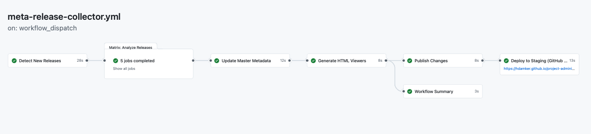

# Release Collector v3 - User Guide

**Status**: Production Ready (Phase 3 Complete - Staging Deployment Active)
**Last Updated**: 2025-11-05

## What This Workflow Does

Automatically tracks all CAMARA API releases across repositories, categorizes them by meta-release (Fall24, Spring25, Fall25), and generates browsable HTML reports showing API versions, maturity levels, and portfolio information.

**For Maintainers**: See [QUICKSTART.md](../QUICKSTART.md) for a 2-minute guide and [MAINTAINER-FAQ.md](../MAINTAINER-FAQ.md) for common questions.

## Overview

The Release Collector is a GitHub Actions workflow that provides comprehensive release tracking and reporting for the CAMARA project.

**Key Features**:
- Incremental updates (analyze only new releases)
- Full re-analysis capability (reprocess all releases)
- Runtime enrichment with portfolio metadata
- Self-contained HTML viewers deployed to GitHub Pages
- Multiple execution modes (dry-run, PR)

## Quick Start

### Running the Workflow

1. Navigate to **Actions** tab in the repository
2. Select **Release Collector v3** workflow
3. Click **Run workflow**
4. Configure options:
   - **Analysis scope**: `incremental` or `full`
   - **Execution mode**: `dry-run` or `pr`
   - **Debug mode**: Enable for detailed logs (optional)
   - **Force viewers**: Force regeneration of HTML viewers (optional)

### Recommended Settings

**For weekly updates (recommended)**:
```
Analysis scope: incremental
Execution mode: pr
Debug mode: false
Force viewers: false
```

**For testing or workflow changes**:
```
Analysis scope: full
Execution mode: dry-run
Debug mode: true
Force viewers: true
```

**After configuration changes** (api-landscape.yaml, mappings):
```
Analysis scope: full
Execution mode: pr
Force viewers: true
```

## What to Do After Workflow Runs

### If PR is Created

1. **Navigate to the PR**
   - Look for "Review: CAMARA release data updates from Release Collector bot" PR
   - Check the PR description for staging viewer links

2. **Review Changes** (checklist):
   - [ ] Check file diff - do the data changes make sense?
   - [ ] Review master YAML: releases look accurate, no duplicates
   - [ ] Preview viewers using staging links in PR description
   - [ ] Verify no sensitive data (API keys, internal URLs) exposed
   - [ ] JSON reports are valid (workflow validates automatically)

3. **Test Staging Viewers**
   - Click staging URLs in PR description
   - Verify data displays correctly
   - Test filtering and search features
   - Check for any obvious data quality issues

4. **Merge the PR**
   - Use **squash and merge** to keep history clean
   - Delete the branch after merge

### If No PR is Created

This is normal when:
- No new releases detected (incremental mode)
- Generated data identical to existing data (full mode)
- No changes after analysis

**Action**: Review workflow logs to confirm expected behavior

### Downloading Artifacts

For testing or manual review:
1. Go to workflow run page
2. Scroll to "Artifacts" section
3. Download `release-reports-{run-number}`
4. Extract ZIP to view HTML viewers locally

## Configuration Options

### Analysis Scope

#### Incremental Mode (Default)
**When to use**: Regular weekly runs, continuous monitoring

**What it does**:
- Detects only NEW releases since last run
- Compares current GitHub state with `data/releases-master.yaml`
- Fast execution (typically 1-2 minutes)
- Updates master metadata incrementally

**Example**: If you ran the workflow last week and 3 new releases were published, incremental mode will only analyze those 3 releases.

#### Full Mode
**When to use**:
- After workflow script changes
- After configuration updates (api-landscape.yaml, mappings)
- Data validation or correction
- Initial setup

**What it does**:
- Re-analyzes ALL releases across all repositories
- Ignores current state of releases-master.yaml
- Longer execution (typically 3-5 minutes)
- Rebuilds master metadata from scratch

**Example**: After updating api-landscape.yaml with new category assignments, use full mode to regenerate all reports with the new categories.

### Execution Mode

#### Dry-run Mode
**When to use**: Testing, validation, preview changes before creating PR

**What it does**:
- Runs complete workflow pipeline
- Generates all reports and viewers
- Creates downloadable artifacts (no commits)
- Safe for experimentation

**Output**: Download `release-reports-*` artifact from workflow run

#### PR Mode (Recommended for Production)
**When to use**: All production updates, weekly monitoring

**What it does**:
- Runs complete workflow pipeline
- Validates generated files (YAML, JSON, HTML)
- Checks for changes (skips PR if no changes)
- Creates pull request for review
- Requires approval before deployment

**PR title**: `Review: CAMARA release data updates from Release Collector bot`

**Safety features**:
- Diff detection prevents empty PRs
- Validation ensures file integrity
- Review required before merge
- No direct pushes allowed

**Merge instructions**: Use **squash and merge** to keep main history clean. Each workflow run creates a single logical change.

**Viewer deployment** (Phase 3 - Active): Viewers are automatically deployed to GitHub Pages staging for preview. Staging URLs are included in the PR description. Viewers are also available in workflow artifacts for download.

## Production Deployment

After merging a PR, run the **Release Collector - Production Deploy** workflow to:
1. Deploy viewers to the public site (camaraproject.github.io)
2. Upload release-metadata files to GitHub releases

### Workflow Options

| Option | Default | Description |
|--------|---------|-------------|
| `deploy_viewers` | `true` | Deploy HTML viewers to production site |
| `upload_metadata` | `true` | Upload release-metadata files to GitHub releases |
| `upload_releases` | (empty) | Selective upload filter (e.g., "QualityOnDemand/r1.2"). Empty = all releases |
| `ref` | (empty) | **Rollback only**: Git ref from main branch history to deploy |
| `allow_branch` | `false` | **Emergency mode**: Allow deployment from any branch |
| `dry_run` | `false` | Preview deployment without making changes |

### Deployment Modes

| Mode | When | Safety Checks |
|------|------|---------------|
| **Default** | `ref` and `allow_branch` both empty | Compares staging vs main timestamps to prevent deploying stale content |
| **Rollback** | `ref` specified (e.g., `abc123`) | Verifies ref is from main branch history |
| **Emergency** | `allow_branch` = true | No safety checks - deploys from current branch |

### Upload Analysis

The workflow analyzes each release and reports the action needed:

| Status | Description |
|--------|-------------|
| **NEW** | Metadata files don't exist on release (will upload) |
| **UPDATE** | Metadata files exist but content differs (will replace) |
| **CURRENT** | Metadata files exist and are identical (no action) |
| **NO_RELEASE** | Release doesn't exist in repository (error) |
| **FAILED** | Upload failed (apply mode only) |

### Upload Report

The workflow generates an artifact `release-metadata-upload-report-{run_number}` containing:
- `upload-report.md` - Human-readable summary with per-release details
- `upload-report.jsonl` - Machine-readable JSONL format

### Required Permissions

The `PRODUCTION_DEPLOY_TOKEN` must have **Contents: Read and Write** permission for camaraproject repositories to upload release assets.

### Debug Mode

**When to use**: Troubleshooting, detailed analysis

**What it does**:
- Enables verbose logging
- Shows detailed processing steps
- Includes API response details
- Helps diagnose issues

## Understanding the Output

### Generated Files

#### Committed to Repository (PR Mode)

```
data/
├── releases-master.yaml          # Master metadata (GitHub facts only)
└── release-artifacts/            # Staged release metadata (uploaded to releases)
    └── {repo}/
        └── {tag}/
            └── release-metadata.yaml

reports/
├── all-releases.json             # Complete dataset (enriched)
├── fall24.json                   # Fall 2024 meta-release
├── spring25.json                 # Spring 2025 meta-release
└── fall25.json                   # Fall 2025 meta-release
```

#### Deployed to Staging / Available in Artifacts (Not Committed)

```
viewers/
├── fall24.html                   # Fall 2024 viewer
├── spring25.html                 # Spring 2025 viewer
├── fall25.html                   # Fall 2025 viewer
├── portfolio.html                # Portfolio overview viewer (Alpha)
└── internal.html                 # Internal admin viewer (Alpha)
```

**Note**: Viewers are generated but not committed to the repository (gitignored). They are available:
- **Staging deployment** (Phase 3 - Active): Automatically deployed to GitHub Pages for preview, URLs in PR description
- **Workflow artifacts**: Download `release-reports-*` for local testing
- **Production deployment** (Phase 4 - Planned): Automated deployment to camaraproject.github.io

### Data Flow

#### Workflow Phases (Visual)

When you run the workflow, you'll see these phases execute in GitHub Actions:



*Screenshot showing the 5-phase workflow execution with staging deployment*

The workflow executes in this order:
1. **Detect New Releases** (28s) - Discovers releases to analyze
2. **Analyze Releases** (parallel matrix) - Processes releases in parallel (up to 6 jobs)
3. **Update Master Metadata** (12s) - Updates master YAML with analyzed data
4. **Generate Release Metadata** (15s) - Creates YAML/JSON metadata files for each release
5. **Generate HTML Viewers** (8s) - Creates self-contained HTML viewers
6. **Publish Changes** (8s) - Creates PR with data/reports
7. **Deploy to Staging** (13s) - Deploys viewers to GitHub Pages for preview
8. **Workflow Summary** (3s) - Generates execution summary

#### Data Pipeline (Technical)

```
GitHub API
    ↓
detect-releases.js → Discovers release tags (rX.Y pattern, includes pre-releases)
    ↓
analyze-release.js → Extracts API metadata, applies format corrections
    ↓
update-master.js → Updates releases-master.yaml (facts only)
    ↓
generate-release-metadata.js → Creates YAML/JSON for each release (staged)
    ↓
generate-reports.js → Enriches with api-landscape.yaml, creates JSON reports
    ↓
generate-viewers.js → Embeds data in HTML templates, creates self-contained viewers
```

### Key Concepts

#### Master Metadata (releases-master.yaml)
- **Pure GitHub facts**: repository, tag, date, API version, commonalities
- **No portfolio metadata**: No categories, URLs, descriptions
- **Source of truth**: Basis for all reports and viewers
- **Format corrections applied**: v-prefix removal, commonalities normalization

#### API Landscape (/config/api-landscape.yaml)
- **Portfolio metadata**: Categories, URLs, tooltips, display names
- **Applied at runtime**: During report generation only
- **Not stored in master**: Keeps master clean and factual
- **Easy updates**: Change landscape, run full re-analysis

#### Runtime Enrichment
- Reports combine master facts + landscape enrichments
- Viewers embed enriched data (self-contained, no external dependencies)
- Separation allows independent updates

#### Pre-Releases and Release Types
The collector tracks all release types, not just public releases:

| Release Type | Detection | Example Tag |
|--------------|-----------|-------------|
| `pre-release-alpha` | API version contains `-alpha.N` | r1.1 with version `0.5.0-alpha.1` |
| `pre-release-rc` | API version contains `-rc.N` | r1.1 with version `1.0.0-rc.1` |
| `public-release` | Initial or stable version, not on maintenance branch | r1.2 with version `1.0.0` |
| `maintenance-release` | Release on `maintenance-rX` branch for release cycle X | r1.3 on maintenance-r1 with version `1.0.1` |

**Notes:**
- r0.X tags are excluded (invalid release tags, not tracked)
- Pre-releases appear in viewers with release type badges
- Internal viewer allows filtering by release type

#### Archived Repositories

CAMARA API repositories that have been archived (topic `archived-api-repository` and GitHub archived status) are included in the collection pipeline:

- **Detection**: The `detect-releases.js` script matches `archived-api-repository` alongside the other maturity topics (sandbox, incubating, graduated). The GitHub API returns releases for archived repos (read-only access is preserved).
- **Data**: Archived releases and repositories carry `repository_archived: true` in `releases-master.yaml`. This field is optional and only present when `true` (same pattern as `superseded`).
- **Reports**: Archived releases appear in all reports without filtering. Historical meta-release data remains complete (e.g., HomeDevicesQoD in Fall24).
- **Viewers**: Archived repositories and APIs display a gray "Archived" badge.
- **Campaigns**: Campaign workflows skip archived repositories automatically (PRs cannot be created on archived GitHub repos).
- **Mismatch validation**: The collector cross-validates the `archived-api-repository` topic against the GitHub `repo.archived` status. Mismatched repositories are skipped with a warning in the PR body and workflow step summary. See [FAQ #16](../MAINTAINER-FAQ.md#16-workflow-shows-a-warning-about-archived-repository-mismatch) for details.

#### Release Metadata Files
For each release, the collector generates a `release-metadata.yaml` file that is uploaded to the GitHub release:

**Content includes:**
- Repository and release tag
- Release type and date
- API details (name, version, title)

These files enable tooling validation to be self-contained (no dependency on project-administration at runtime).

## Typical Workflows

### Daily Monitoring (Default)
```yaml
Schedule: Daily at 04:35 UTC
Analysis: incremental
Execution: pr
Result: Pull request created if changes detected
```

### After Configuration Changes
```yaml
Trigger: Manual workflow dispatch
Analysis: full
Execution: dry-run (first), then pr
Result: Regenerated reports with new configuration
```

### Testing New Features
```yaml
Branch: Feature branch
Analysis: full
Execution: dry-run
Result: Artifact download for testing
```

## Troubleshooting

### No new releases detected (incremental mode)
**Cause**: No releases published since last run

**Solution**: Normal behavior, no action needed. Workflow completes successfully without creating PR.

### No PR created even though I expected changes
**Cause**: Generated data matches existing files exactly (no diff detected)

**Solution**:
- Check workflow logs for "No changes detected" message
- Verify format corrections aren't the only changes (already applied)
- Run in dry-run mode and examine artifacts to confirm data

### Workflow failed with "Enrichment not found for API X"
**Cause**: An API exists in releases but not in api-landscape.yaml

**Solution**:
1. Note the exact API name from error logs
2. Add it to /config/api-landscape.yaml (see Maintenance section)
3. Run full re-analysis to enrich all reports

**Note**: This is a warning, workflow continues but API won't have category/tooltip

### Analysis errors for specific repository
**Cause**: Missing or invalid API definition in release assets

**Solution**:
- Check repository release page for OpenAPI files
- Verify file names match expected patterns
- Check if release is in excluded list (data-corrections.yaml)

### Viewers show outdated data
**Cause**: Viewers only regenerate when data changes or templates change

**Solution**: Run workflow with `force_viewers: true` to regenerate all viewers

### Workflow timeout or very slow
**Cause**: Too many releases to process or API rate limits

**Solution**:
- Check GitHub API rate limit status
- Verify parallel jobs are running (max 6)
- Network issues may slow API calls
- Full re-analysis takes 3-5 minutes (see [Analysis Scope](#analysis-scope))

### PR merge conflicts
**Cause**: Multiple workflow runs or manual edits to master YAML

**Solution**:
- Close conflicting PRs
- Run fresh workflow with full re-analysis
- Do not manually edit releases-master.yaml

### How to read workflow logs
**Enable debug mode** for detailed diagnostics:
1. Run workflow with Debug mode: true
2. Check each phase in workflow logs:
   - Detect: Shows release count and what will be analyzed
   - Analyze: Shows per-repository analysis progress
   - Update: Shows master metadata changes
   - Reports: Shows enrichment statistics
   - Viewers: Shows generation and deployment

**For more troubleshooting**: See [MAINTAINER-FAQ.md](../MAINTAINER-FAQ.md)

## Configuration Files

### meta-release-mappings.yaml
Maps repository releases to meta-releases:
```yaml
Fall24:
  DeviceLocation:
    - r1.3
  QualityOnDemand:
    - r1.2
```

### api-landscape.yaml
Portfolio metadata for enrichment:
```yaml
- api_name: device-location-verification
  title: Device Location Verification
  category: Location and Tracking
  camaraproject_org_url: https://camaraproject.org/device-location-verification/
  display_name: Device Location Verification
  published: true
  first_release: Fall24
```

### Format Corrections (Hardcoded)
Format corrections are applied automatically during analysis in `scripts/analyze-release.js`:

**Corrections applied**:
- **Version prefix removal**: Strips `v` prefix (e.g., `v0.11.0` → `0.11.0`)
- **Commonalities normalization**: Converts to string format and normalizes `0.4.0` → `0.4`
- **API name normalization**: Converts to lowercase for consistency

These corrections are hardcoded and applied to all releases automatically. No configuration file needed.

## Architecture Overview

**For Maintainers**: You don't need to understand the architecture to run the workflow. This section is for context only.

**Key principles**:
- Clean separation: GitHub facts (master YAML) vs portfolio metadata (landscape YAML)
- Runtime enrichment: Metadata applied during report generation, not stored in master
- Self-contained viewers: Embed all data and libraries (no backend required)
- Static hosting: GitHub Pages compatible

**For Developers**: See [architecture/](architecture/) for detailed architectural decision records (ADRs) including:
- [ADR-0001: Feature-Grouped Organization](architecture/0001-feature-grouped-organization.md)
- [ADR-0002: Runtime Enrichment Architecture](architecture/0002-runtime-enrichment-architecture.md)
- [ADR-0003: Archived Repository Handling](architecture/0003-archived-repository-handling.md)

## Maintenance

### Adding New Meta-Releases
See [issue #100](https://github.com/camaraproject/project-administration/issues/100) for the future enhancement for upcoming meta-releases.

### Adding New APIs
1. Add to `/config/api-landscape.yaml`
2. Run full re-analysis to enrich existing releases

### Updating Categories or URLs
1. Update `/config/api-landscape.yaml`
2. Run full re-analysis to regenerate reports

## Migration Notes

This is version 3 of the meta-release collector workflow:

- **v1**: Original implementation (deprecated)
- **v2**: API-releases workflow (legacy, still in use)
- **v3**: Current implementation with runtime enrichment

v3 will be the primary workflow until Spring 2026 when native `release-metadata.yaml` files become standard in CAMARA repositories.

### Schema Version 2.1.0

Schema 2.1.0 adds support for archived repositories (per [#147](https://github.com/camaraproject/project-administration/issues/147)):

**New field in releases-master.yaml:**
- `repository_archived`: Optional boolean (only present when `true`) on both `releases[]` and `repositories[]` entries

### Schema Version 2.0.0

Schema 2.0.0 includes property name alignment (per [#69](https://github.com/camaraproject/project-administration/issues/69)):

**New fields in releases-master.yaml:**
- `release_type`: Classification (pre-release-alpha, pre-release-rc, public-release, maintenance-release)
- `repositories`: Array of all repos with quick-reference release pointers

**Property changes in master-metadata-schema:**
| Old Name | New Name | Location |
|----------|----------|----------|
| `version` | `api_version` | apis array |
| `title` | `api_title` | apis array |

**New output:**
- `release-metadata.yaml` / `.json` generated for each release
- Staged in `data/release-artifacts/{repo}/{tag}/`
- Uploaded to GitHub releases during production deploy

## Support

For issues or questions:
- Check workflow logs for error messages
- Enable debug mode for detailed diagnostics
- Review [troubleshooting section](#troubleshooting) above
- Consult architecture documentation in [architecture/](architecture/)

---

*This workflow is part of the CAMARA project infrastructure. For more information, see the [project-administration repository](https://github.com/camaraproject/project-administration).*
